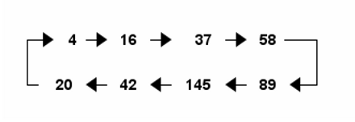

# 202. Happy Number

## Statement

Write an algorithm to determine if a number `n` is happy.

A **happy number** is a number defined by the following process:

Starting with any positive integer, replace the number by the sum of the squares of its digits.
Repeat the process until the number equals 1 (where it will stay), or it **loops endlessly in a cycle** which does not include 1.
Those numbers for which this process **ends in 1** are happy.
Return `true` if `n` is a happy number, and `false` if not.

**Example 1**:
```text
Input: n = 19
Output: true
Explanation:
12 + 92 = 82
82 + 22 = 68
62 + 82 = 100
12 + 02 + 02 = 1
```

**Example 2:**
```text
Input: n = 2
Output: false
``` 

**Constraints:**

- `1 <= n <= 2^31 - 1`

## Solution
### Intuition
Check the outputs for some integers. This is actually a mathematical loop. Take any positive integer n and sum the squares of its digits. If you repeat this operation, eventually you’ll either end at 1 or cycle between the eight values 4, 16, 37, 58, 89, 145, 42, and 20.



### Approach
- Calculate the sum of squared digits until its 4 or 1
- `return` `False` if its 4
- `return` `True` if its 1


### Complexity
- Time complexity: `O(x*log(n))`, where `x` is iterations to reach 1 or 4
- Space complexity: `O(1)`


### Code
```python
class Solution:
    def isHappy(self, n: int) -> bool:
        
        while n != 4:
            next_num = 0
            while n > 0:
                next_num += (n % 10) ** 2
                n //= 10
            n = next_num

            if n == 1: return True
            
        return False
```